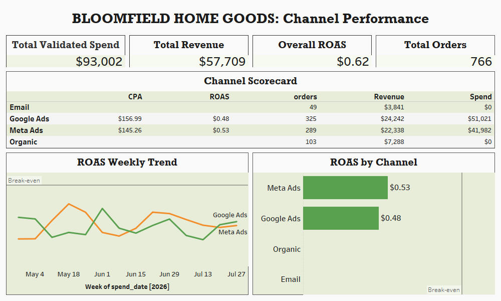
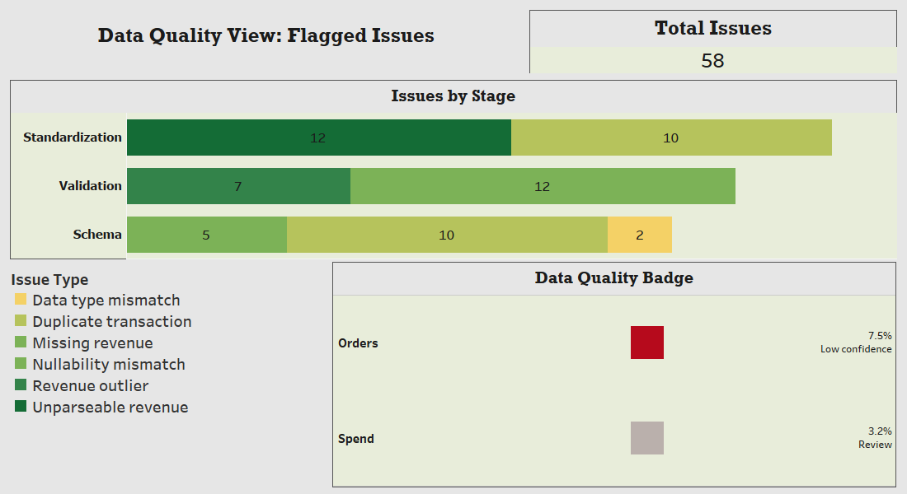

# E-Commerce Growth Engine: Automated Data Validation & Multi-Channel Dashboard

**Fictional client:** Bloomfield Home Goods (mid-size home goods e-commerce brand)
**Stack:** MySQL · Python (Pandas) · Tableau

> All data in this project is synthetic. I generated it and planted data-quality problems on purpose to mimic messy real-world exports.

---

## The Business Problem

Bloomfield's marketing team reports ad spend and performance every week, but those numbers kept disagreeing with the order revenue Finance saw. Duplicate entries, missing days, inconsistent channel names and unreliable alerts meant leadership no longer trusted the reports, and wouldn't approve more budget until they could.

**The goal:** build an automated validation layer that catches bad data before it reaches a dashboard, then show trustworthy channel performance leadership can act on.

## What I Built

1. **MySQL database** (`bloomfield_growth_engine`): staging tables for spend, orders and alerts, loaded from raw CSVs.
2. **Standardization layer:** SQL that cleans channel names into one consistent set (Email, Google Ads, Meta Ads, Organic).
3. **Python QA pipeline** (`qa_pipeline.py`): re-runnable checks for schema problems, standardization issues and validation failures, producing a timestamped **flagged issues report**.
4. **Tableau dashboards:**
   - **Channel Performance:** validated spend, revenue, ROAS, CPA and orders by channel
   - **Data Quality View:** a trust indicator showing what was flagged in the raw data

## Data Quality Findings

The QA pipeline flagged **58 issues** across three stages:

| Stage | Issues |
|---|---|
| Standardization | 22 |
| Validation | 19 |
| Schema | 17 |

Issue types found: duplicate transactions, unparseable revenue, missing revenue, revenue outliers, nullability mismatches and data type mismatches. I also found 23 spend rows with non-standard channel names.

## Business Findings

| Metric | Value |
|---|---|
| Total validated spend | $93,002 |
| Total revenue | $57,709 |
| Overall ROAS | $0.62 |
| Total orders | 766 |

| Channel | Orders | Revenue | CPA | ROAS |
|---|---|---|---|---|
| Google Ads | 325 | $24,242 | $156.99 | $0.48 |
| Meta Ads | 289 | $22,338 | $145.26 | $0.53 |
| Organic | 103 | $7,288 | n/a | n/a |
| Email | 49 | $3,841 | n/a | n/a |

**What this means in plain language:**
- Both paid channels return less than $1 for every $1 spent, so paid acquisition is currently losing money.
- Meta Ads is slightly more efficient than Google Ads, with a lower cost per order and a higher return.
- Organic and Email have no ad spend, so ROAS doesn't apply to them, but together they brought in 152 orders.

## Dashboard Preview




## Repository Structure

```
├── data/          raw generated CSVs
├── sql/           schema, standardization and validation queries
├── python/        qa_pipeline.py
├── reports/       sample flagged_issues_report.csv
├── dashboard/     dashboard screenshots
└── docs/          full case study
```

## How to Run

1. Create the database and tables using the scripts in `sql/`.
2. Load the CSVs from `data/` into the staging tables.
3. Run `python python/qa_pipeline.py` to generate a new flagged issues report.
4. Open the report in Tableau to refresh the Data Quality View.

## Skills Demonstrated

Data validation and QA · SQL (MySQL) · Python/Pandas · Data cleaning and standardization · Tableau dashboard design · Marketing metrics (ROAS, CPA) · Translating findings for business stakeholders

## About Me

I'm Serena, a Data Analyst who turns messy data into numbers people can trust.
**Contact:** add your email / LinkedIn / Upwork link here

